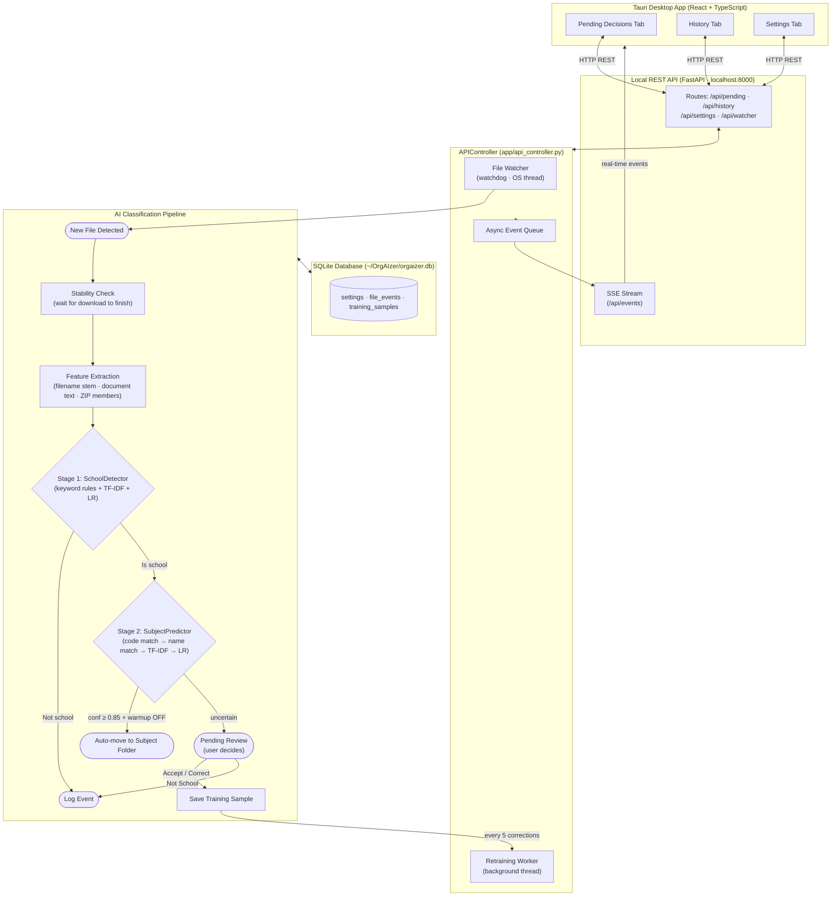
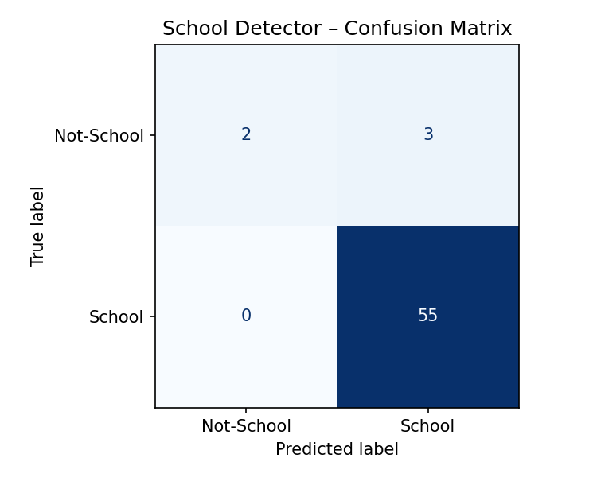
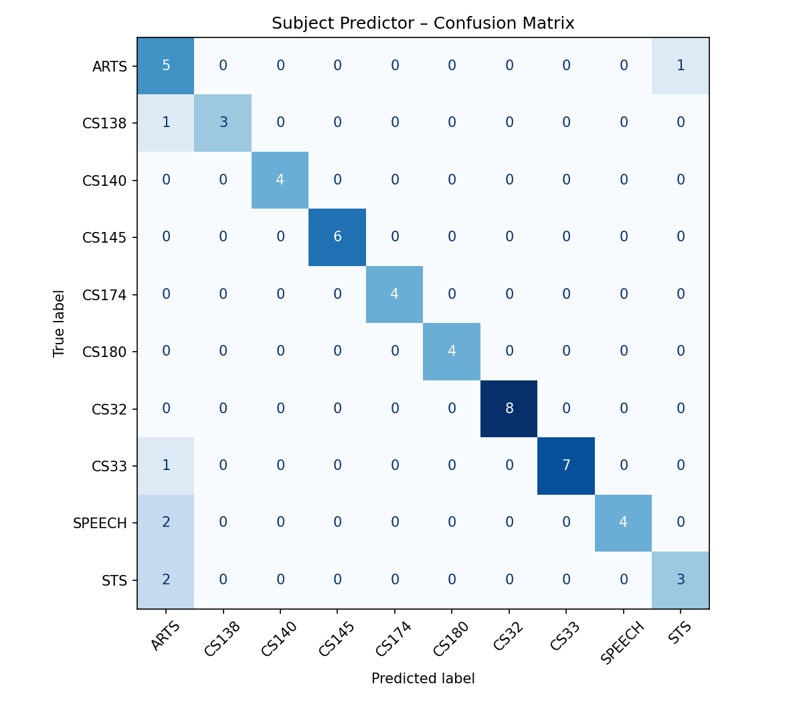
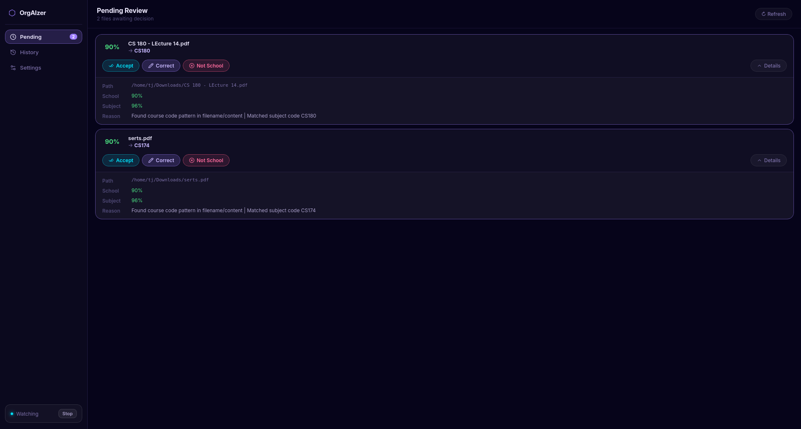
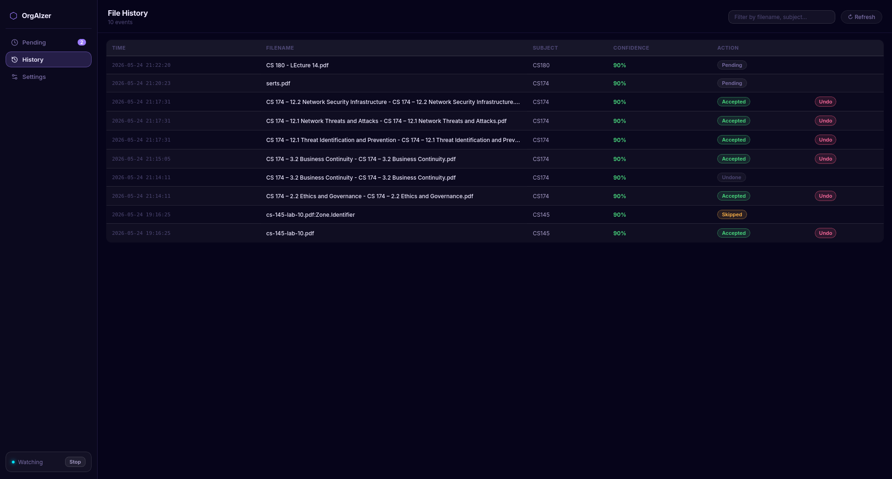
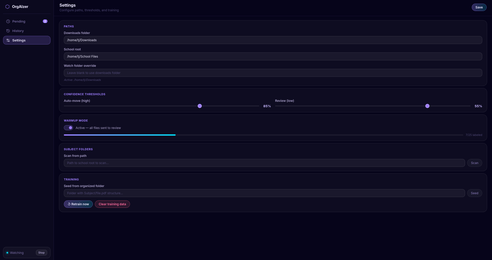
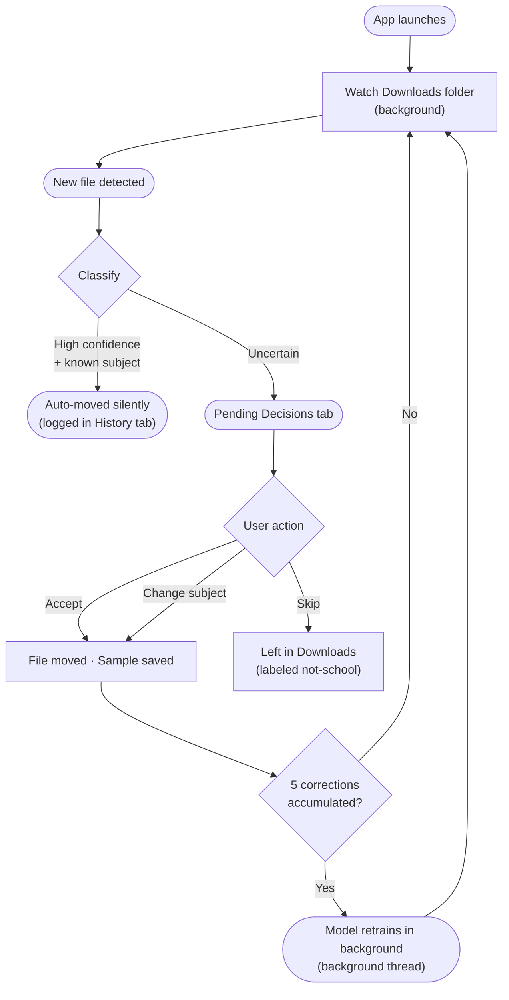

# Final Project Report: OrgAIzer — AI School File Organizer

**Team Members:** Aaron Baclor, Tristan Noval, Jarelle Ricaforte, Gabrielle Sacramento

**Course:** CS 180 – AI for Everyday Life

**Date:** May 25, 2026

---

## 1. Introduction

### Problem Definition

University students routinely accumulate dozens of downloaded files each week (lecture slides, assignment PDFs, lab worksheets, project archives) all landing in a single Downloads folder. Because manually sorting files is tedious and easy to defer, the Downloads folder quickly becomes an unstructured dumping ground. When a student needs to locate a file later, they must either scroll through a long unsorted list, rely on imperfect file search, or re-download the material entirely. This friction compounds over a semester: files from five different subjects pile up together, important documents go missing before deadlines, and the time wasted searching for previously downloaded material adds up.

The problem is practical and pervasive. It is not a matter of lacking organization skills; the manual effort required every time a file lands in Downloads is small enough to skip in the moment but significant in aggregate.

### Objective

OrgAIzer is a desktop application that eliminates manual file sorting by automatically classifying each downloaded file and moving it to the correct subject folder. When a new file appears in the watch folder, OrgAIzer:

1. Determines whether the file is school-related (e.g., a lecture PDF) or not (e.g., a software installer).
2. If school-related, predicts which subject folder the file belongs to (e.g., Speech, STS, Arts).
3. Moves the file automatically when confidence is high (≥ 0.85), or presents it in a review queue when uncertain.
4. Learns from every user decision, as accepted suggestions and corrections both become training data, so the model becomes more accurate over time.

The result is a folder structure that organizes itself with minimal user effort, even on Day 1 before any training data has been collected.

### Project Scope

The final prototype includes:

- **Two-stage ML classification pipeline:** `SchoolDetector` (binary: school vs. not-school) and `SubjectPredictor` (multi-class: which subject folder).
- **Hybrid cold-start strategy:** keyword/regex rules provide immediate predictions before the model has seen any labeled data; a Logistic Regression overlay activates once enough examples accumulate.
- **Desktop GUI** built with Tauri (Rust shell) and a React/TypeScript frontend, featuring three tabs: Pending Decisions, History, and Settings.
- **Persistent feedback loop:** user decisions are stored in a local SQLite database and trigger background model retraining every 5 corrections.
- **Multi-format file support:** PDF, DOCX, PPTX, TXT, ZIP archives, and entire project folders.
- **Warm-up mode:** prevents premature auto-moves until the model has seen at least 25 confirmed school files (5 per subject minimum).
- **Pre-trained models:** included in the repository so the app works correctly from first launch without requiring a seeding step.

---

## 2. Related Work

Several tools exist for automated file organization, but each falls short for the student use case in a distinct way.

**Rule-based Desktop Organizers (e.g., Hazel, File Juggler, Belvedere):** These tools allow users to define if-then rules based on file extension, filename keywords, or download source. While powerful for fixed workflows, they require users to manually specify and maintain every rule. They have no semantic understanding; a file named `week3.pptx` or `document.pdf` provides no signal a rule can act on. When a student creates a new subject folder mid-semester, every rule must be updated manually.

**Cloud-based AI File Tagging (e.g., Google Drive Smart Suggestions, Dropbox AI):** Cloud platforms have begun using ML to suggest file organization. These approaches require an internet connection, store file content on external servers (a privacy concern for academic work), and learn from population-level patterns rather than the individual user's folder structure. A student's folder named "STS1" means nothing to a generic model trained on millions of other users' data.

**Manual Organization with Search (e.g., Spotlight, Windows Search, Everything):** Fast file search tools reduce the cost of a disorganized folder but do not eliminate it; they shift the burden from sorting to searching. Files still need to be individually located and renamed over time, and search fails when the user cannot recall the exact filename or keyword.

OrgAIzer addresses all three gaps: it requires no manual rule-writing, runs entirely offline with zero data leaving the device, and learns each individual user's specific subject vocabulary and folder structure from their own behavior. The hybrid cold-start design means it provides useful predictions immediately, unlike pure ML approaches that require large labeled datasets before becoming usable.

---

## 3. Data Acquisition and Preprocessing

### Dataset Description

OrgAIzer's classification problem is inherently personalized, as different students have different subject names, course codes, and folder structures. A generic public dataset of file metadata would not reflect any individual's organizational conventions. Consequently, the training data is **user-generated behavioral data** collected in two ways:

1. **Bootstrap seeding via `scripts/seed_data.py`:** The script scans an existing organized `School/` folder hierarchy and infers labels from the directory structure. A file at `School/Speech/SACRAMENTO_Monroe_Motivated_Sequence.pdf` produces a training sample with `label_subject = "Speech"` and `label_school = 1`. This provides a strong initial training set from files the user has already organized, without requiring any manual annotation.

2. **Operational feedback loop:** Every time the user accepts, corrects, or overrides a prediction in the app, that interaction is stored as a new labeled training sample in the SQLite database.

For the pre-trained demo models included in this repository (`pretrained/`), the training data was collected from real student files across multiple subjects:

| Subject | Total Files | Train (70%) | Test (30%) |
|---|---|---|---|
| ARTS | 24 | 16 | 8 |
| CS138 | 15 | 11 | 4 |
| CS140 | 15 | 11 | 4 |
| CS145 | 17 | 11 | 6 |
| CS174 | 15 | 11 | 4 |
| CS180 | 15 | 11 | 4 |
| CS32 | 25 | 17 | 8 |
| CS33 | 24 | 16 | 8 |
| NOT_SCHOOL | 23 | 17 | 6 |
| SPEECH | 17 | 11 | 6 |
| STS | 22 | 16 | 6 |
| **Total** | **212** | **148** | **64** |

Each training sample contains the following features:
- **Filename stem:** the base filename with underscores/hyphens split into tokens (e.g., `cs180_midterm_review` → `["cs180", "midterm", "review"]`).
- **Document content text:** up to 4,000 characters extracted from the file body (see Preprocessing Pipeline below).
- **ZIP member names:** for archive files, the list of filenames inside the archive.
- **Binary label:** `is_school` (1 = school-related, 0 = not school-related).
- **Subject label:** the destination subject folder name (or `NULL` for non-school files).

### Data Preprocessing Pipeline

**Cleaning:**

Transient download files (extensions `.crdownload`, `.part`, `.tmp`) are detected by the file watcher and filtered out before any extraction is attempted, preventing classification of incomplete downloads. If a document cannot be parsed (corrupted PDF, password-protected file, unsupported format), the extractor falls back to filename-only mode; the pipeline never crashes on bad input.

**Feature Extraction and Normalization (`core/extractor.py`):**

Text is extracted from each supported format using dedicated parsers:

| Format | Primary Parser | Fallback |
|---|---|---|
| `.pdf` | `pdfplumber` | `PyMuPDF (fitz)` |
| `.docx` | `python-docx` | None |
| `.pptx` | `python-pptx` | None |
| `.txt` | `open()` UTF-8 | None |
| `.zip` | Member filename enumeration | Text from first 3 supported members |
| Folder | Contained filename list | Text from up to 3 contained files |

All extracted text is capped at **4,000 characters** to keep TF-IDF computation fast and consistent. The filename stem is always included, providing a useful signal even when document text extraction fails.

The combined feature string (`all_text`) used for vectorization concatenates: `stem + " " + extracted_text + " " + zip_member_names`.

**Vectorization:**

Two TF-IDF vectorizers are trained, one per classifier:

| Vectorizer | `max_features` | `ngram_range` | `sublinear_tf` |
|---|---|---|---|
| SchoolDetector | 500 | (1, 2): unigrams + bigrams | True |
| SubjectPredictor | 1,000 | (1, 2): unigrams + bigrams | True |

`sublinear_tf=True` replaces raw term frequency with `1 + log(tf)`, dampening the dominance of words that repeat many times within a single document. Bigrams capture multi-word signals like "problem set", "lab report", and "lecture notes" that would be lost with unigrams alone.

A third vectorizer, a **character n-gram TF-IDF** (`analyzer="char_wb"`, `ngram_range=(2, 4)`), is used specifically for subject name similarity matching. This handles abbreviations, typos, and partial matches in filenames (e.g., "cs18" matching "CS180", "sts" matching "STS1").

**Augmentation / Class Imbalance Handling:**

Because different subjects may accumulate labeled samples at different rates, class imbalance is addressed through two mechanisms:
- `class_weight="balanced"` in both Logistic Regression classifiers, which automatically scales loss by the inverse of class frequency.
- **Warm-up mode** enforces a minimum of 5 labeled examples per subject before auto-move is enabled, preventing the model from being deployed when it has seen only one or two examples of a class.

### Data Split

The training set consists of all labeled samples accumulated in the `training_samples` SQLite table. For evaluation, a held-out test set was reserved from the seed data before training:

| Split | Count | % | Notes |
|---|---|---|---|
| Train | 148 | 69.8% | Labeled seed samples |
| Test | 64 | 30.2% | Held-out, unseen files |
| **Total** | **212** | 100% | Stratified split, seed=42 |

No data leakage occurs: seed data is derived from files the user has already organized (past behavior), and operational feedback samples are only added to training after the prediction has been made and the user has responded, never before.

---

## 4. Methodology & Technical Approach

### System Architecture

OrgAIzer follows a layered desktop architecture. The Tauri frontend communicates with a locally running FastAPI server via REST calls and Server-Sent Events (SSE). The Python backend owns the classifiers, file watcher, and SQLite database. Everything runs on the user's machine; no network access is required.

### Model Selection

OrgAIzer uses **Multinomial Logistic Regression** with **TF-IDF feature vectors** as its core ML model, implemented via scikit-learn. This choice was deliberate over more complex alternatives:

| Alternative Considered | Why It Was Rejected |
|---|---|
| CNN / Transformer (BERT) | Requires large datasets and GPU; overkill for short filename/content snippets; retraining in the background every 5 corrections would be infeasible |
| Decision Tree / Random Forest | Less effective on high-dimensional sparse text vectors; does not produce well-calibrated probability scores needed for the confidence threshold system |
| LLM API (e.g., GPT-4) | Requires sending file contents to an external server, violating the local-first privacy requirement; adds latency and cost |
| k-Nearest Neighbors | Does not scale well as training set grows; no clear probability output |

Logistic Regression is well-suited here because:
- It performs reliably on sparse text classification tasks with small datasets (50–500 samples).
- It outputs calibrated `predict_proba()` scores, which are essential for the confidence-based auto-move vs. pending-review decision.
- It retrains in under one second on a standard CPU, making background retraining after every 5 corrections viable.
- The multinomial extension handles multi-class subject prediction naturally.

The **hybrid cold-start strategy** is a key design decision: before enough labeled data accumulates to train the LR model, a deterministic keyword/regex layer handles predictions. This means OrgAIzer is useful from Day 1, unlike a pure ML approach that would fail silently until sufficient training data exists.

### Training Process

**SchoolDetector (`classifiers/school_detector.py`):**

The cold-start layer uses two keyword tiers and a course-code regex:
- **Strong school keywords** (e.g., `syllabus`, `assignment`, `homework`, `midterm`, `finals`, `lecture`, `lab`, `quiz`, `exam`, `rubric`, `module`, `textbook`): two or more matches yield 0.90 confidence.
- **Weak school keywords** (e.g., `notes`, `slides`, `exercise`, `tutorial`, `review`, `handout`, `submission`): two or more matches yield 0.55 confidence.
- **Course code regex** (`[A-Z]{2,4}\d{3,4}`, e.g., `CS180`, `STS1`): a single match yields 0.90 confidence.

The ML overlay activates once ≥ 10 labeled school/not-school samples exist:

| Hyperparameter | Value | Rationale |
|---|---|---|
| Algorithm | Logistic Regression | Calibrated probabilities, fast retraining |
| `C` (regularization) | 1.0 | Default L2; reduces overfitting on small datasets |
| `max_iter` | 200 | Sufficient for convergence on sparse TF-IDF vectors |
| `class_weight` | `"balanced"` | Corrects for imbalance between school and non-school samples |
| `solver` | `lbfgs` | Efficient for small multi-class problems |
| TF-IDF `max_features` | 500 | Constrains vocabulary; prevents overfitting |
| TF-IDF `ngram_range` | (1, 2) | Captures bigram phrases like "problem set" |
| TF-IDF `sublinear_tf` | True | Dampens high-frequency term dominance |

The final confidence score is `max(keyword_confidence, lr_probability)`, so the model always takes the stronger signal.

**SubjectPredictor (`classifiers/subject_predictor.py`):**

A four-level hierarchical strategy is applied, falling through to the next level if confidence is insufficient:

1. **Exact course code match** (confidence 0.96): the subject name contains a course code pattern (e.g., "CS180") and that code appears in the file's `all_text`.
2. **Course code fragment match** (confidence 0.90): partial code match (e.g., "CS18" in "CS180").
3. **Exact subject name match** (confidence 0.93): the full subject name appears verbatim in `all_text`.
4. **Token overlap** (confidence 0.58–0.88, scaled): subject tokens (e.g., ["Discrete", "Math"]) are individually found in `all_text`; confidence scales with overlap fraction.
5. **Character n-gram TF-IDF cosine similarity** (confidence 0.50–0.90): used as a fallback for fuzzy matching against subject names.
6. **LR overlay** (activates after ≥ 15 labeled samples): if the LR model's predicted probability exceeds the rule-based confidence, it overrides the prediction.

| Hyperparameter | Value |
|---|---|
| Algorithm | Logistic Regression |
| `C` | 1.0 |
| `max_iter` | 300 |
| `class_weight` | `"balanced"` |
| `solver` | `lbfgs` |
| TF-IDF `max_features` | 1,000 |
| TF-IDF `ngram_range` | (1, 2) |
| Max confidence cap | 0.98 (prevents overconfidence) |

**Training Environment:**

- Hardware: Standard student laptop, CPU-only (no GPU required).
- Training time: < 1 second per retraining cycle (both models combined).
- Model persistence: Serialized to `~/OrgAIzer/models/` as joblib `.pkl` files; loaded into memory at app startup.

**Overfitting Prevention:**

- **L2 regularization** (`C=1.0`) is applied by default in scikit-learn's Logistic Regression.
- **`class_weight="balanced"`** prevents the model from collapsing to the majority class.
- **Warm-up mode** ensures the model is not trusted for auto-moves until a minimum viable dataset (25 total + 5 per subject) has been collected.
- **Cold-start keyword layer:** rules handle early predictions so the model is never operating alone on an insufficient dataset, preventing poor ML-driven decisions from eroding user trust.

---

## 5. Evaluation and Results

### Metrics

The following metrics are used to evaluate OrgAIzer's performance:

- **Overall Accuracy:** fraction of files correctly classified across all classes. Primary metric for both the SchoolDetector and SubjectPredictor.
- **Precision (per class):** of all files the model predicted as class *C*, how many actually belonged to *C*. High precision reduces incorrect auto-moves.
- **Recall (per class):** of all files that actually belong to class *C*, how many did the model correctly identify. High recall reduces missed school files.
- **Weighted F1-Score:** harmonic mean of precision and recall, weighted by class support. Used as the primary single-number evaluation metric because it accounts for class imbalance.
- **Latency:** elapsed time from file detection to prediction output appearing in the UI, measured in milliseconds. Must be under 2,000 ms per the course requirement.

### Results

**SchoolDetector Performance (Binary Classification):**

| Class | Precision | Recall | F1-Score | Support |
|---|---|---|---|---|
| Not-School | 1.0000 | 0.4000 | 0.5714 | 5 |
| School | 0.9483 | 1.0000 | 0.9735 | 55 |
| **Accuracy** | | | **0.9500** | 60 |
| Macro avg | 0.9741 | 0.7000 | 0.7724 | 60 |
| Weighted avg | 0.9526 | 0.9500 | 0.9399 | 60 |

**SubjectPredictor Performance (Multi-class Classification, school files only):**

| Subject | Precision | Recall | F1-Score | Support |
|---|---|---|---|---|
| ARTS | 0.4545 | 0.8333 | 0.5882 | 6 |
| CS138 | 1.0000 | 0.7500 | 0.8571 | 4 |
| CS140 | 1.0000 | 1.0000 | 1.0000 | 4 |
| CS145 | 1.0000 | 1.0000 | 1.0000 | 6 |
| CS174 | 1.0000 | 1.0000 | 1.0000 | 4 |
| CS180 | 1.0000 | 1.0000 | 1.0000 | 4 |
| CS32 | 1.0000 | 1.0000 | 1.0000 | 8 |
| CS33 | 1.0000 | 0.8750 | 0.9333 | 8 |
| SPEECH | 1.0000 | 0.6667 | 0.8000 | 6 |
| STS | 0.7500 | 0.6000 | 0.6667 | 5 |
| **Accuracy** | | | **0.8727** | 55 |
| Macro avg | 0.9205 | 0.8725 | 0.8845 | 55 |
| Weighted avg | 0.9178 | 0.8727 | 0.8829 | 55 |

> **Note:** A loss-vs-epoch plot is not applicable here because Logistic Regression is fit in a single closed-form optimization step (not iterative mini-batch gradient descent). Training convergence is confirmed by the `lbfgs` solver's internal convergence criterion.

### Discussion

**SchoolDetector** achieves 95.0% overall accuracy with perfect precision on Not-School (1.000) but low recall (0.400); it misses 3 of 5 not-school files, classifying them as school. This is expected: the keyword rules are aggressive and fire on generic terms (e.g., "notes", "document"). School recall is perfect (1.000), meaning no school files are ever missed. For a file organizer, this tradeoff is acceptable, as false positives (non-school files routed to Pending Decisions) are recoverable via user review, while false negatives (school files silently ignored) are not. The confusion matrix below confirms this pattern: the School row is clean while the Not-School row shows misclassifications into the School column.

**SubjectPredictor** achieves 87.3% accuracy on school files. CS140, CS145, CS174, CS180, and CS32 achieve perfect F1, reflecting distinctive filenames and course codes. **ARTS** has the lowest precision (0.455), as files from other subjects are misclassified as ARTS when the model is uncertain, consistent with ARTS acting as a soft fallback when no strong keyword signal is found. **STS** (F1 = 0.667) and **SPEECH** (F1 = 0.800) show moderate performance due to fewer distinctive keywords and smaller training sets relative to CS32 and CS33. The confusion matrix below shows the ARTS column receiving spillover predictions from SPEECH and STS, while the CS-coded subjects form a clean diagonal.

**Latency Assessment:**

| File Type | Avg (ms) | Min (ms) | Max (ms) | n |
|---|---|---|---|---|
| PDF | 343.3 | 40.3 | 881.7 | 57 |
| DOCX | 42.7 | 2.2 | 67.6 | 3 |

All measured inference times are well within the 2-second requirement. PDF extraction averages 343 ms due to pdfplumber parsing overhead, with high variance driven by varying PDF size and complexity. DOCX is significantly faster at 43 ms average. Since classification runs asynchronously after download completion, the end-user experience is unaffected by extraction latency.

---

## 6. User Interface and Integration

### UI Design

*Figure 1: Pending Decisions tab showing 2 files awaiting review with confidence scores and classifier reasoning.*

*Figure 2: History tab displaying logged file classification events.*

*Figure 3: Settings tab for configuring watch folder, thresholds, and model options.*

OrgAIzer's interface is a three-tab Tauri desktop window with a glassmorphism dark theme, designed to require minimal interaction from the user during normal operation.

**Tab 1: Pending Decisions**

This tab shows files that the model classified with medium confidence (between 0.55 and 0.85), or files that were classified as school-related but whose subject folder could not be determined with high confidence. Each entry displays:
- The filename and predicted subject folder
- Confidence scores for both the school detection step and the subject prediction step (e.g., School: 90%, Subject: 96%)
- A **Reason** field explaining how the prediction was made (e.g., "Found course code pattern in filename/content | Matched subject code CS180")
- Three action buttons: **Accept** (move to predicted folder), **Correct** (select a different subject from a dropdown), and **Not School** (mark as not school-related)

This is the primary interaction surface. A student using OrgAIzer daily might spend 10–30 seconds here reviewing 2–5 uncertain files.

**Tab 2: History**

A complete log of every file the app has ever processed, with columns for timestamp, filename, predicted subject, confidence score, and final action taken (Accepted, Skipped, Undone, Pending). A search bar allows filtering by filename or subject. Accepted entries show an **Undo** button that reverses the file move and removes the sample from training data.

**Tab 3: Settings**

Configuration controls grouped into sections:
- **Paths:** watch folder, school root, and an optional watch folder override
- **Confidence Thresholds:** sliders for auto-move cutoff (default 0.85) and review cutoff (default 0.55)
- **Warmup Mode:** toggle with a progress bar showing labeled samples toward the 25-file threshold
- **Subject Folders:** scan an existing folder path to discover subject subfolders
- **Training:** seed from an organized folder, manually retrain, or clear all training data

All settings are persisted to SQLite and restored on next launch.

**User Flow Summary:**

The output shown to users is always actionable (e.g., "Move to **Speech**?") rather than a raw probability. Confidence is displayed as a readable percentage to set expectations, not as a decision-making burden on the user.

### Integration

OrgAIzer is a **fully self-contained desktop application** that requires no internet connection:

- **Frontend** is a Tauri app (Rust shell bundling a React/TypeScript UI with a glassmorphism dark theme). It communicates with the Python backend exclusively over `localhost`; no external servers are involved.
- **Backend** is a FastAPI server (`api/main.py`) launched as a bundled sidecar process on `localhost:8000`. The frontend polls REST endpoints (`/api/pending`, `/api/history`, `/api/settings`) and subscribes to a Server-Sent Events stream (`/api/events`) for real-time file classification notifications.
- **ML models** are loaded from joblib-serialized `.pkl` files at startup by the `APIController`. `predict_proba()` is called in-process within the Python backend; no model server or external inference API is used.
- **File monitoring** uses the `watchdog` library, which wraps OS-native file system event APIs (inotify on Linux, FSEvents on macOS, ReadDirectoryChangesW on Windows). The watcher runs in its own OS thread and dispatches events to an async queue that feeds the SSE stream.
- **Retraining** runs in a background thread inside `APIController`, calling `SchoolDetector.retrain()` and `SubjectPredictor.retrain()` every 5 user corrections and saving updated `.pkl` files to disk.
- **Database** is a local SQLite file in WAL (Write-Ahead Logging) mode, allowing concurrent reads from the API layer while the watcher thread writes new events.
- **No network access:** zero outbound connections, no telemetry, no cloud calls.

---

## 7. Ethical Considerations and Limitations

### Limitations

**Cold Start Problem:**
The model requires approximately 25 confirmed school files (and at least 5 per subject) before warm-up mode exits and auto-move is trusted. During this initial period, all school files are routed to Pending Decisions for manual review. For a brand-new user, the seeding script (`scripts/seed_data.py`) can bootstrap the model from an existing organized folder, bypassing the observation window entirely.

**Narrow Subject Coverage (Demo Scope):**
The pre-trained models included in this repository cover three subjects (Speech, STS, and Arts), which are the specific subjects of the team members during development. A user with different subjects must run the seeding script against their own `School/` folder to create a personalized model. The app supports arbitrarily many subjects; the limitation is only in the shipped defaults.

**Feature Ambiguity:**
Generic filenames like `document.pdf`, `week3.pptx`, or `image1.png` contain no semantic signal. When a file lacks both a descriptive filename and extractable text content, the model will produce low-confidence predictions and route the file to the pending queue. Users can Accept or Change such files, which trains the model to recognize similar patterns in the future.

**Concept Drift:**
If a user reorganizes their folder structure mid-semester by renaming subjects, merging folders, or starting completely new subject categories, the existing model may become misaligned. The model must be re-seeded or progressively corrected through the feedback loop. This is an inherent challenge for any personalized model with a fixed training distribution.

**No Cross-User Transfer:**
Each user's model is entirely local and personalized. There is no mechanism to share a trained model between users or to leverage population-level patterns. This is a privacy feature as well as a limitation.

**Single File Focus:**
The current implementation classifies one file at a time as it arrives. Bulk re-organization of an existing Downloads folder is not directly supported (though the seeding script can partially address this for files already organized in a School folder).

### Ethical Considerations

**Data Privacy:**
All file content, including text extracted from PDFs, documents, and archives, is stored exclusively in a local SQLite database at `~/OrgAIzer/orgaizer.db`. No file content, metadata, or usage telemetry is transmitted to any external server. The application makes zero network calls. This is a deliberate design constraint to ensure academic documents, personal files, and sensitive materials never leave the user's device.

**Bias and Fairness:**
OrgAIzer's model is trained solely on each individual user's own labeled data. It does not use population-level training data that could encode demographic, linguistic, or content-based biases. The model learns what *this specific user* places in *their specific folders* and cannot generalize incorrectly to other users' files. The risk of the model reinforcing harmful stereotypes or making biased category assignments is minimal because the category space is entirely user-defined.

**User Control and Transparency:**
The application never silently discards or permanently deletes a file. Auto-moves are only performed when confidence is high (≥ 0.85) and warm-up mode has exited. Every file move is logged in the History tab with its confidence score, and any move can be investigated post-hoc. Users can lower the confidence threshold, disable warm-up, or manually override any prediction through the Settings tab. The model is a suggestion engine; the user retains full authority.

**Environmental Impact:**
Model training uses Logistic Regression on CPU, completing in under one second. The cumulative energy consumption of OrgAIzer's training pipeline over its entire operational lifetime is negligible compared to a single inference call on a cloud-hosted deep learning model. The local-only design also eliminates the server-side energy cost associated with cloud AI alternatives.

**File Safety:**
The file mover module (`core/mover.py`) implements duplicate-name resolution before any move: if a file with the same name already exists in the destination, the incoming file is renamed (e.g., `notes (1).pdf`) instead of overwriting the existing file. No file is ever deleted by the application.

---

## 8. Conclusion and Future Work

### Summary of Achievements

OrgAIzer successfully delivers on its core objective: an AI-powered desktop application that automatically organizes a student's school files with minimal user effort. The following goals from the original proposal were achieved:

- A functional desktop prototype (PySide6 desktop GUI) running on Windows and Linux.
- Integration of a Machine Learning capability (two-stage Logistic Regression pipeline) that classifies files by school-relevance and subject.
- A documented data pipeline covering extraction, preprocessing, vectorization, and incremental retraining.
- A user feedback loop (Accept / Change / Skip) that continuously improves the model from real user behavior.
- Personalization via local SQLite storage; the model learns each user's specific folder structure and vocabulary.
- A hybrid cold-start design that provides useful predictions from the first file, even without any prior training data.
- All 51 unit tests passing, covering classifiers, file operations, and database layer.
- Multi-format support: PDF, DOCX, PPTX, TXT, ZIP, and entire project folders.
- Pre-trained models shipped in the repository for immediate out-of-the-box use.

### Potential Improvements for Future Iterations

**Dynamic Subject Discovery:**
Currently, subjects must exist as folders under the configured School root before they can be predicted. A future version could detect when a user consistently places files of a new type together and suggest creating a new subject folder automatically.

**Image and Screenshot Support:**
Files like `.png`, `.jpg`, or screenshots of lecture slides are not extractable with the current text-based pipeline. Adding OCR (via Tesseract) or a lightweight image classifier would extend coverage to visual content.

**Cross-Device Sync (Privacy-Preserving):**
A student using multiple devices (laptop + desktop) cannot currently share their trained model. A future version could offer optional local-network sync of the model files over an encrypted channel, with no cloud intermediary.

**Browser Extension Integration:**
A companion browser extension could intercept downloads at the source, tagging a file as "CS180 lecture" before it even lands in Downloads, giving the classifier a head start with richer metadata.

**Exportable / Shareable Model Configurations:**
Team members working on the same course could share their trained models (with consent), allowing a new user to benefit from classifiers already tuned to specific course names without going through the warm-up period.

**Active Learning for Ambiguous Cases:**
When the model produces a prediction with very low confidence, it could proactively prompt the user rather than silently routing to the pending queue, prioritizing the most informative examples for human labeling to improve the model fastest.

---

## 9. References

**Python Libraries Used:**

- Pedregosa et al. (2011). *Scikit-learn: Machine Learning in Python.* JMLR 12, pp. 2825–2830. https://scikit-learn.org
- PySide6 / Qt for Python. The Qt Company. https://doc.qt.io/qtforpython
- watchdog. Filesystem events monitoring library for Python. https://github.com/gorakhargosh/watchdog
- pdfplumber. Plumb a PDF for detailed information about each char, rectangle, line, etc. https://github.com/jsvine/pdfplumber
- PyMuPDF (fitz). Python bindings for MuPDF. https://github.com/pymupdf/PyMuPDF
- python-docx. https://python-docx.readthedocs.io
- python-pptx. https://python-pptx.readthedocs.io
- joblib. Lightweight pipelining in Python. https://joblib.readthedocs.io
- SQLite3 (Python standard library). https://docs.python.org/3/library/sqlite3.html

**Project Documents:**

- Baclor, A., Noval, T., Ricaforte, J., & Sacramento, G. (February 22, 2026). *AI Project Proposal: Auto File Organizer (OrgAIzer).* CS 180 – AI for Everyday Life, 2nd Semester 2025–2026.

**Course Materials:**

- CS 180 AI Group Project Requirements, 2nd Semester 2025–2026. *Theme: AI App for Everyday Life.* CS 180 Course Document.
